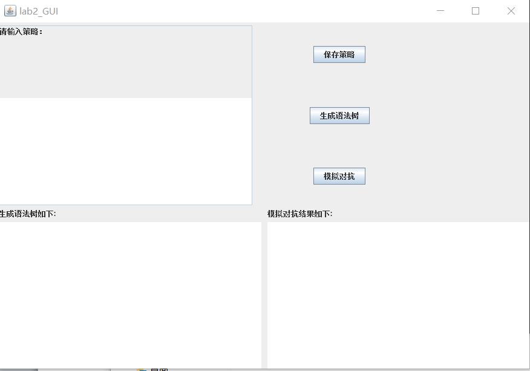
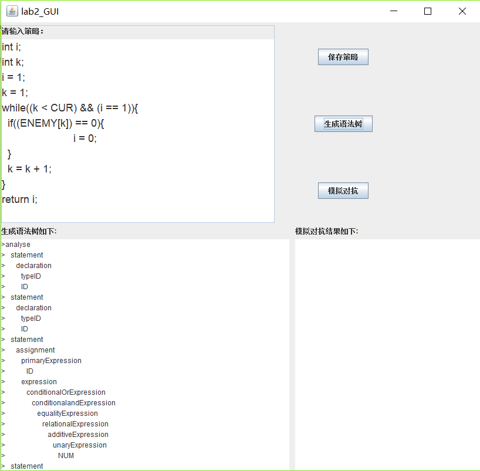
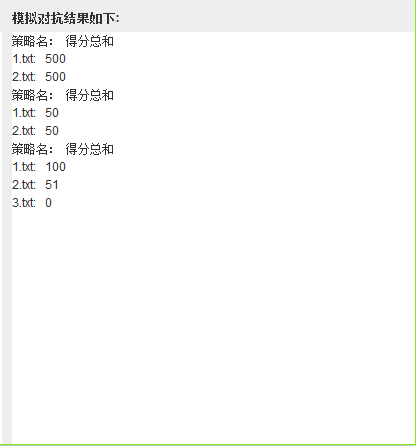
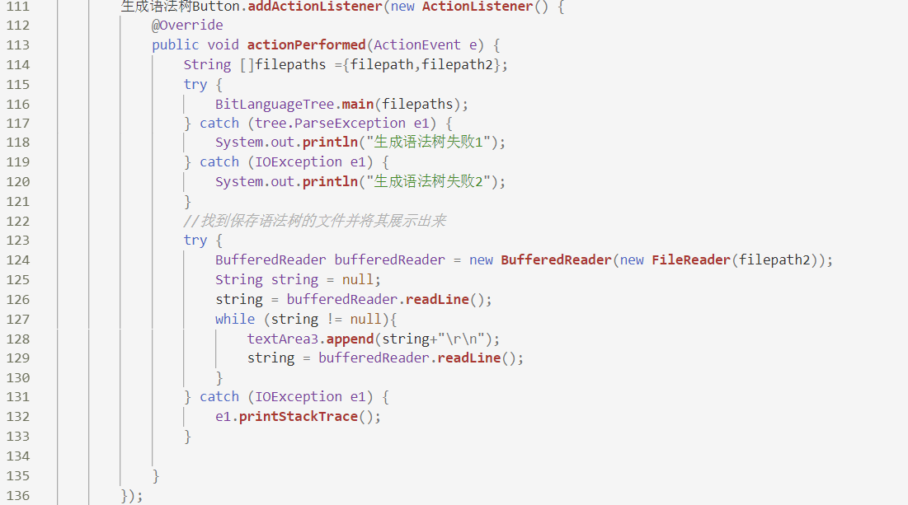
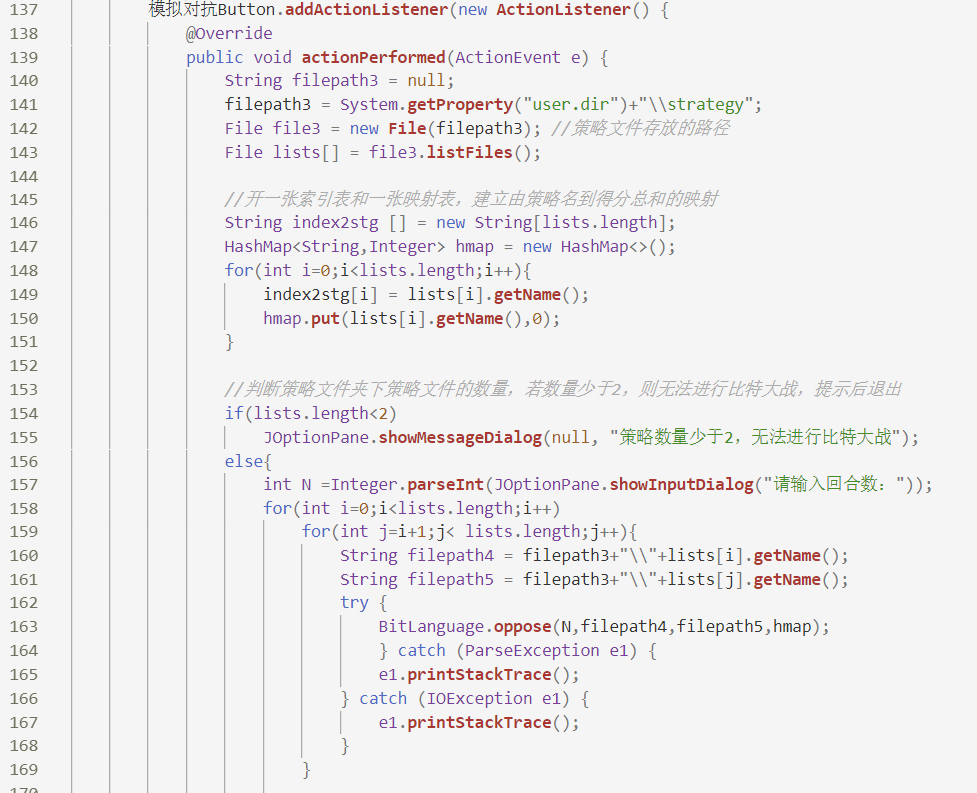

**

## **实验内容：比特大战**

1.  **游戏简介**

这个游戏来源于《自私的基因》。一个N回合的比特大战由A和B两方进行，每个回合A和B可以选择0（背叛）或1（合作），共进行N个回合。如果第n（1\<=n\<=N）个回合A和B的选择分别为An和Bn，则他们在这个回合的得分SA(n)和SB(n)由下表决定：

|      | Bn=0            | Bn=1            |
|------|-----------------|-----------------|
| An=0 | SA(n)=1,SB(n)=1 | SA(n)=5,SB(n)=0 |
| An=1 | SA(n)=0,SB(n)=5 | SA(n)=3,SB(n)=3 |

A和B的总分为N个回合各自得分的和。

1.  **游戏策略**

对于N个回合的比特大战，每个回合的得分可能是0，1，5。因此总分总是在0和5\*N之间。双方不同的策略可能导致不同的得分。以下是一些可能的策略：

 （T1）永远合作，每次都选择1

 （T2）随机，每次以某个概率随机选择1，否则选择0

 （T3）针锋相对，先选择1，以后每次都选择对方的上一次选择

 （T4）老实人探测器，基本上和针锋相对一样，只是会随机地选择一次0

 （T5）永不原谅，一直选择1，一旦对方选择0，则一直选择0

1.  **问题描述**


（B1）设计一种程序设计语言可以用来描述比特大战的策略。这个语言应该至少可以描述T1-T5的策略，并用这个语言描述更多的策略。


（B2）实现对这个语言的语法分析。定义相应的语法树，并且可以输出语法分析结果。当出现可能的输入错误时，可以指出出错的位置和可能的错误原因。


（B3）实现一个程序：用户可以输入若干的策略，每个策略保存为一个文本文件，模拟这些策略两两之间的N回合（例如，N
= 200）的比特大战，并以所有对战得分的总和为这些策略排序。

**实验要求：**

实验结果不应只包含源程序代码，还应包括一个实验报告文档（建议命名为 design.doc 或
design.pdf）、编译与运行程序的脚本。此外，至少还要包括一个纯文本的自述文件
readme.txt，其中描述你自己的姓名、学号等基本信息。实验结果全部存放在一个名为“学号姓名”（中间不要任何空格）的文件夹中。

**说明：本实验实现的编程语言为Java**

1.  **功能介绍：**

2.  程序运行后，这是程序的主界面。

1.  在左上角的输入框里可键入策略，键入后点击“保存策略”按钮，只有符合文法规则的策略，才能保存，否则会提示输入策略不符合文法规则。

1.  当输入符合文法规则的策略并保存后，点击“生成语法树”按钮，程序会生成对应的语法树。

1.  在进行模拟对抗前，应确保程序已经保存有两个或两个以上的策略，否则会提示：

1.  当程序里已保存两个或两个以上的策略后，点击“模拟对抗”按钮后，将会提示输入回合数，填写完后点击确定，将会把结果展示出来。

1.  **设计思路：**

2.  工具介绍：

本程序采用Javacc来生成语法分析程序，并且采用Javacc的一个扩充JJTree来生成对应的语法树。

JavaCC
是一个能生成语法和词法分析器的生成程序。语法和词法分析器是字符串处理软件的重要组件。编译器和解释器集成了词法和语法分析器来解释那些含有程序的文件，其中词法和语法分析器被广泛用于各种应用，是用以首先定义用户将要使用的语言，然后用该定义解析相应的条目并且对各种后端数据库制定正确的查询的一种方法。

1.  比特大战游戏的文法规则：

compilationUnit -\> statement

statement -\> ";" \| VarDeclaration ";" \| assignment \| block \|
statementExpression \| ifStatement \| whileStatement \| returnStatement ";"

block -\> "{" (statement)\* "}"

ifStatement -\> "if" "(" expression ")" statement \| "if" "(" expression ")"
"else" statement

WhileStatement -\> "while" "(" expression ")" statement

VarDeclaration -\> theType ID

theType -\> "boolean" \| "int"

returnStatement -\> "return" expression

assignment -\> primaryExpression "=" expression

expression -\> globalRandom \| globalEnemy \| assignment \|
conditionalOrExpression

primaryExpression -\> CUR \| NUM \| ID \| "(" expression ")"

globalRandom -\> RANDOM "(" expression ")"

globalEnemy -\> ENEMY "[" expression "]"

conditionalOrExpression -\> conditionalOrExpression "\|\|"
conditionalandExpression \| conditionalandExpression

conditionalandExpression -\> conditionalandExpression "&&" inclusiveOrExpression
\| inclusiveOrExpression

inclusiveOrExpression -\> inclusiveOrExpression "\|" exclusiveOrExpression \|
exclusiveOrExpression

exclusiveOrExpression -\> exclusiveOrExpression "\^" andExpression \|
andExpression

andExpression -\> andExpression "&" equalityExpression \| equalityExpression

equalityExpression -\> equalityExpression equalop relationalExpression \|
relationalExpression

relationalExpression -\> relationalExpression relop additiveExpression \|
additiveExpression

equalop -\> "==" \| "!="

additiveExpression -\> additiveExpression addop multiplicativeExpression \|
multiplicativeExpression

relop -\> "\>" \| "\>=" \| "\<" \| "\<="

multiplicativeExpression -\> multiplicativeExpression mulop unaryExpression \|
unaryExpression

addop -\> "+" \| "-"

unaryExpression -\> "\~" unaryExpression \| "!" unaryExpression \|
primaryExpression

mulop -\> "\*" \| "/" \| "%"

1.  Javacc的语法描述文件：

利用Javacc生成对应的语法分析程序的关键是语法描述文件。JavaCC的语法描述文件是扩展名为.jj的文件，一般情况下，语法描述文件的内容采用如下形式：

*options {*

*JavaCC的选项*

*}*

*PARSER_BEGIN(解析器类名)*

*package 包名;*

*import 库名;*

*public class 解析器类名 {*

*任意的Java代码*

*}*

*PARSER_END(解析器类名)*

*扫描器的描述*

*解析器的描述*

在完成对语法描述文件的编写后，即可使用Javacc工具来生成对应的语法分析程序，具体做法为：在控制台使用javacc命令运行.jj文件，即可生成语法分析程序的.java文件。

1.  **核心代码**

>   生成语法树：

>   模拟对抗：

**四、实验总结**

本实验的主要要求是根据实验要求描述的比特大战游戏，总结其文法规则，并根据文法规则生成其语法分析程序和语法树，设计出游戏界面并完善这个游戏。文法规则的总结是本实验的基础，然而在这个环节我便遇到了困难，分析后是自己在文法规则这方面训练甚少，所以在实验初期就遇到了困难。本实验的语法分析程序和语法树分别是用Javacc和JTree这两个工具实现的，这两个工具在网上的资料较少，所以在搜集资料的过程也是遇到了很多困难，好在最后一一克服了。

------

# 开发日志

开发语言：Java 
GUI工具包：Swing 
开发环境：IntelliJ IDEA 2018.2.5 x64 

## todo-list

- [x] 设计一种程序语言用来描述比特大战，该语言能描述已给的以及更多的策略

- [x] 实现这个语言的语法分析，定义相应的语法树

- [x] 用户输入若干策略，每个策略保存为一个文本文件，并展示其相应的语法树

- [x] 模拟这些策略两两之间的N回合（例如，n=200）的比特大战，并以所有对战得分的总和为这些策略排序

- [ ] 完善图形界面的设计

  ------

  ### 第二版

  2019/4/18  张烁

  实现“模拟这些策略两两之间的N回合（例如，n=200）的比特大战，并以所有对战得分的总和为这些策略排序”的功能。

  使用方法：运行程序后，点击“模拟对抗”按钮（若系统路径下策略文件的数量小于2，则会提醒策略数量不够的信息），跳出弹窗输入回合数，策略的排序结果和总分会在对应模块展示。

  

  ### 第一版

  2019/4/10  张烁

  1.GUI用的是swing，文件在src\src\lab2_GUI.java, 但是swing的控件不熟悉，所以界面设计的不如意（比如，运行程序后的初始化窗口大小、以及用以输入策略的输入框等）

  2.文法规则在src\src\BitLanguage.txt文件里

  3.lan文件夹和tree文件夹下分别存放着用以语法分析和生成语法树的类

  4.用户在输入策略后，点击“保存策略”按钮后，会进行语法分析，若通过语法分析，则会将该策略以txt形式保存在根目录下strategy文件夹下。

  5.用户只有在输入策略，保存成功后，点击“生成语法树”按钮后才会显示其语法树。